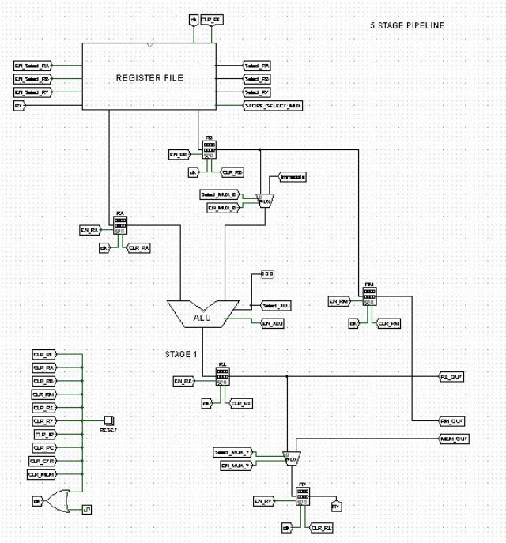
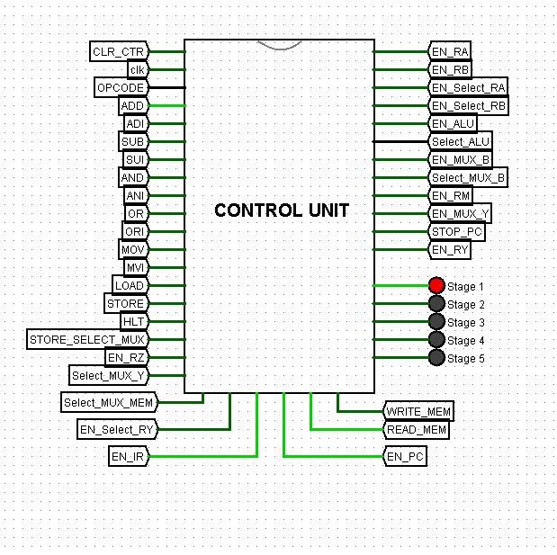

# RISC-32bit-Processor
**32-bit Processor Design**

**Computer Organization and Architecture Laboratory | Mini Project**

BY

AKSHAT ANAND - 20CS01044 KUSHAGRA KHARE - 20CS02004

🔖**Contents**

1. **Problem Statement**
1. **Overall Architecture**
1. **Components**
1. **Instruction Encoding**
1. **Control Signals**
1. **Program Conversion Examples**
1. **Usage Instructions**

🌟**Problem Statement**

Designing of a 32-bit RISC processor that will support the following assembly instructions:

- MOVE Ri, Rj : The content of Rj is transferred to Ri.
- MOVE Ri, Immediate (16-bit) : The immediate value (32-bit unsigned extended) will be transferred to Ri.
- LOAD Ri, X (Rj) : The content of memory location [[Rj] + X] is loaded into Ri, where X is a 16-bit unsigned immediate value.
- STORE Ri, X (Rj) : The content of register Ri is stored in memory [[Rj] + X], where X is a 16-bit unsigned immediate value.
- ADD Ri, Rj, Rk : Ri = Rj + Rk.
- ADI Ri, Rj, Immediate (16-bit) : Ri = Rj + Immediate Value (32-bit unsigned extended)
- SUB Ri, Rj, Rk : Ri = Rj - \*\*Rk
- SUI Ri, Rj, Immediate (16-bit) : Ri = Rj - \*\*Immediate Value (32-bit unsigned extended)
- AND Ri, Rj, Rk : Ri = Rj AND Rk.
- ANI Ri, Rj, Immediate (16-bit) : Ri = Rj AND Immediate Value (32-bit unsigned extended)
- OR Ri, Rj, Rk : Ri = Rj OR Rk.
- ORI Ri, Rj, Immediate (16-bit) : Ri = Rj OR Immediate Value (32-bit unsigned extended)
- HLT : Stops the execution.

🤖**Overall Architecture**

**Components Description**

General Purpose 8 *R0 - R7* Registers (GPRs)

Special Purpose 7: *PC, IR, RA, RB, RM, RZ,* Registers (SPRs) *RY*

Memory RAM *16- bit Address Line*

*and 32-bit Data*

Instruction Supported 13(MOV,MVI,LOD,STR,ADD

,ADI,SUB,SUI,AND,ANI,OR, ORI,HLT)

💾**Components**

1. **Processor Pipeline**

2. **Fetch Unit**

- A 32-bit register called the Program Counter. The PC has the address of the memory location which has the next instruction.
- An adder to increment the value of PC by 4, to get to the next instruction address.
3. **Memory Unit**

- 16 (Address-line) X 32 (Data-bit) RAM, to store instructions and data.
- A 1-bit select multiplexer, Memory MUX which chooses the input address to the memory (i.e. either from the ALU or PC), the MUX is always enabled; it shifts to ALU input only when Select is set to 1.
4. **Decode Unit**

- Instruction Register which stores the instruction received from the memory and splits to various parts according to the encoding scheme.
- Opcode Decoder for selecting the instruction based on Opcode from the instruction.

**Instruction Register ( Internal Circuit )**

5. **Control Unit**

- The Control Unit takes input from the clock and current instruction and depending upon the current stage, it gives appropriate control signals to other units.
- Stages are managed using a counter, which goes from 0 to 4 in round robin manner.
- Control Signals are paired with the required stages for each instruction using OR and AND gates.
- Control Signals include various Selects and Enables in Multiplexers, Enables in Registers and some STOP instructions.

**Control Unit (Internal Circuit)**

6. **Register File (Internal Circuit)**

- Register File has two multiplexers for sending required data to two SPRs RA and RB each, and one demultiplexer for writing back data to the required register.
- One MUX k/as STORE MUX to handle the special case for STORE operation.
7. **ALU (Internal Circuit)**

- ALU supports four arithmetic operations for 32-bit numbers addition, subtraction, bitwise AND and bitwise OR.
- ALU supports passing one of the values directly to the output without any operation in case of MOVE and MVI instructions.
- The output is decided by using a multiplexer.

**Encoding**

We have 32-bit encoding of instruction which is converted to 8 digits hex values, where

1. The first four bits are OP Code
1. Next four bits are Destination Ry.
1. Next four bits are Source 1.
1. Next four bits are Source 2
1. Immediate value of 16 bits.

The encoding OP Code are as follows:-

|**OPCOD E**|
**Hexadecima l**

**OPCODE**
|**Instruction**|
| :-: | :-: | - |
|0000|0|ADD Ri, Rj, Rk|
|0001|1|SUB Ri, Rj, Rk|
|0010|2|AND Ri, Rj, Rk|
|0011|3|OR Ri, Rj, Rk|
|0100|4|MOV Ri, Rj|

|0101|5|LOAD Ri, Rj, X|
| - | - | :- |
|0110|6|STORE Ri, Rj, X|
|0111|7|MVI Ri, X|
|1000|8|ADI Ri, X|
|1001|9|SUI Ri, X|
|1010|A|ANI Ri, X|
|1011|B|ORI Ri, X|
|1100|C|HLT|

In case of no Source 2 Register, the 32-bit instruction is modified a bit as the last bit is source 2. Four bits are also used for a total of 8 registers, as given in hexadecimal encoding.

**Registe Binary Hexadecima r l**

**Encodin**

**g Encoding** R0 0000 0

|R1|0001|1|
| - | - | - |
|R2|0010|2|
|R3|0011|3|
|R4|0100|4|
|R5|0101|5|
|R6|0110|6|
|R7|0111|7|

Some Examples using these instructions for various Assembly Commands.

1. ADD R1, R2, R2 : 01220000

OPCODE DEST SRC1 SRC2 IMMEDIATE

0000        0001 0002 0002 0000000000000000

0               1       2 2        0000

2. SUI R1, R2, 200 : 912000C8

OPCODE DEST SRC1 SRC2 IMMEDIATE 1001        0001 0010 0000 0000000011001000 9               1       2 2        00C8

3. MOV R2, R6 : 42600000

OPCODE DEST SRC1 SRC2 IMMEDIATE 0100        0010 0110 0000 0000000000000000 4               2       6 0        0000

Some Sample Examples for Program Conversion using Processor

**Example 1**

**A = B+C-Immediate**

Assuming R2 has the base address, X = 10, Y = 11, Z = 12 and Immediate = 16

|Address|Machine Code|Assembly Code|
| - | - | - |
|0000|Load R1, X(R2); Loads B|512000a0|
|0001|Load R3, Y(R2); Loads C|532000b0|
|0002|Add R1, R1, R3; Adds B+C|01130000|
|0003|Sui R1, R1, #Immediate; Subtracts Immediate from (B+C)|91100100|
|0004|Store R1, Z(R2); Stores result in A|612000C0|
|0005|HLT; Halts execution|C0000000|

**Running the file in Logisim:-**

Open the .circ file and the reset button is to be pressed and then the Assembly code instructions has to be copied to the processor memory space and then the program is executed by fixing a clock cycle.

**Example 2**

**A = ( B OR C ) AND Immediate**

Assuming R2 has the base address, X = 10, Y = 11, Z = 12 and Immediate = 16

|Address|Machine Code|Assembly Code|
| - | - | - |
|0000|Load R1, X(R2); Loads B|512000a0|
|0001|Mov R3, R1; Moves R1 to R3|43100000|
|0002|Loads R1, Y(R2); Loads C|512000b0|
|0003|Move R4, R1; Moves R1 to R4|44100000|
|0004|OR R1, R3, R4; Performs OR of R3 and R4|31340000|
|0005|ANI R5, R1, #Immediate; Performs AND with Immediate|A51001e0|
|0006|Store R5, Z(R2); Stores the result in A|652000c0|
|0007|HLT; Halts execution|C0000000|

We can see after running the circuit that the result is stored in [R2+Z] location in memory.

**Usage Instructions**

1. Convert the assembly code into machine code using the encoding format above.
1. Open the .circ file and click on RESET Button to clear previous data in the processor.
1. Input the machine code into the memory unit present in the main file.
1. Enable ticks in Logisim to run the memory program. Make sure the instructions and data fed to the memory and registers is in the hexadecimal format.

The END

